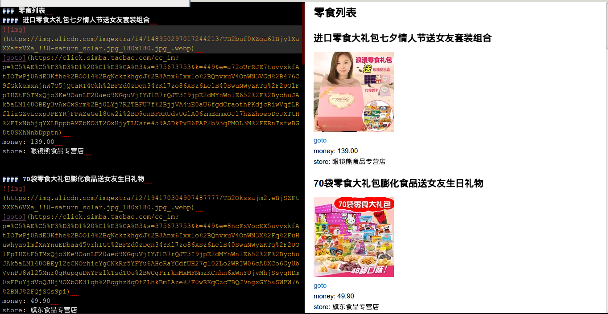

## 牛客编程之美 -- 买零食

因为淘宝页面是动态加载的，爬取动态页面我知道的方法大体上可以分为两种，
* 一是通过抓包获取到其动态加载的接口，通过此接口获取到返回的内容，一般是json 
* 二是通过浏览器执行了js的动态代码然后获取到其加载完成后的页面内容

这里直接用了 python 的 selenium 的 webdriver，通过 chrome 获取到 js 加载后的页面代码，之后提取信息就很简单了，之前一直习惯用正则来提取，这次用了 webdriver 的接口，更方便了 -_-|||，提取信息以后输出到了 markdown 文件中，下面放一张结果图，具体代码就看 taobao.py 吧

